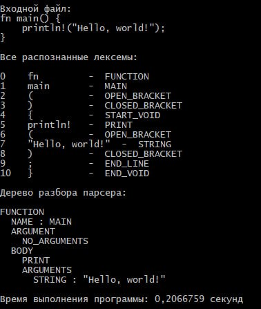

## Транслятор с языка Rust на язык C++

**Транслятор** - это программа, которой на вход подаётся любая программа на входном языке, далее она обрабатывается, и на выходе получается полностью работающая, максимально идентичная программа - на выходном языке программирования

Сам транслятор состоит из нескольких частей:  

**1. Лексер** - он проходит по каждому слову и символу входной программы, и записывает их в массив, распознавая их - присваивая им внутренние идентификаторы, в зависимости от того, является ли элемент ключевым словом, операцией, числом, переменной, или чем-то ещё.

Для обработки и распознавания лексем, было важно учитывать их расположение в коде. Т.к. в некоторых местах, лексемы могли быть полностью (с двух сторон), или частично, быть полностью окружёнными другими лексемами, что затрудняло их распознавание. В последствии, я разбил все лексемы на 2 типа - те, между которыми и другими лексемами обязательно должны быть пробелы, это например такие ключевые слова, как if, while, for, и другие. А второй тип - это лексемы, которые могли спокойно работать внутри других, например +,-,=,(, и похожие. Со вторыми возникла небольшая сложность, но я добавил в программу посимвольный способ обработки таких лексем, что устранило проблему. Весь код Лексера занял ~1200 строчек

 
Нажмите, чтобы просмотреть некоторые объяснения по работе Лексера 
  

Пример работы лексера:

  
**2. Парсер** - строит дерево разбора программы. Он получает на вход все разобранные лексемы из лексера, и далее начинает строить дерево программы. 

Т.е. например, он обрабатывает математические операции, в зависимости от приоритета (сначала умножение и деление, затем сложение и вычитание). Для конструкций If, For, While - он помещает условие в первую часть, а действие при условии - во вторую. Также обрабатываются функции, сначала получаются аргументы, затем - тело функции. Также, парсер присваивает каждой переменной её тип.   

Для структуры парсера было использовано рекурсивно инициализирующееся простое бинарное дерево, а для распознавания структур мною были выделены несколько типов структур в коде, такие как: Блоковые, Строковые, Линейные, и Операторы инициализации. Для построения дерева используется метод делегации - когда парсер распознаёт ту или иную структуру, он передаёт управление в блок её обработки (вместе с позицией обрабатываемой лексемы), и продолжает работу, когда блок возвращает ему управление. таким образом удалось разбить всю обработку на отдельные модули, которые могли сколько угодно раз рекурсивно передавать друг другу управление. Весь код парсера занял ~1200 строчек

 
Описание работы модуля
  
  

Примеры работы дерева разбора парсера:

   
**3. Семантический анализатор** - также важный модуль, он следит за тем, что бы в собираемом коде не было семантических ошибок. 

Например, что бы типы переменных были инициализированы, что бы они не изменялись в процессе программы, что бы не изменялись значения константных переменных, и разные другие важные вещи. 

Например, вот список ошибок, которые выводятся программой:

Пример работы Семантического анализатора:

Обработка синтаксических ошибок, производится на этапе построения дерева Парсера

**4. Кодогенератор** - он, используя дерево разбора парсера, генерирует код на выходном языке. В моём случае это C++. Он идёт по дереву, и также использует метод рекурсивной делегации, для обработки структур выходного кода. Наверное стоит отметить, что совместимость входного и выходного языков была продумана ещё на этапе Лексера. Например, в Rust есть числовые типы с разной размерностью (больше 12 разных), тогда как в C++ есть только 4 стандартных типа. Эти и другие вещи были продуманы ещё в самом начале. Код модуля Кодогенерации, вместе с Семантическим анализатором составил ~600 строчек кода.

---

Пример работы всего Транслятора целиком:

Полная работа над программой, заняла в общей сложности 6 недель.

